</img>
<h1 align="center" id="topo">bienvenido a la API de Bluebank</h1>
Este proyecto consiste en una API para gestionar transacciones de un banco ficticio utilizando Java, MySQL y AWS. Efetuamos una aplicación por medio de Spring Boot, usando Maven con CRUD y dividimos como funciones en microservicios. Para el banco de datos utilizamos MySql con implementación en Docker y pipeline en Jenkins, y por fim, utilizamos AWS como servidor para mantener una aplicación por medio de la instancia EC2.

<h3>Sumário</h3>
<ul>
	<a href="https://storyset.com/work">
		
	</a>

<h1 align="center" id="apresentacao">Apresentação</h1>
Construir una tubería en Jenkins, crear un cliente y catastro de nuestros servicios de SNS para que pueda recibir los correos electrónicos de nuestra API, y mostramos a relização de un saque y de un pago - y los extratos de ambas como transacciones.
<br><br>
<div align="center">
	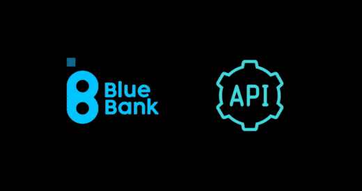</img><br>
	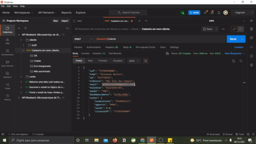</img><br>
	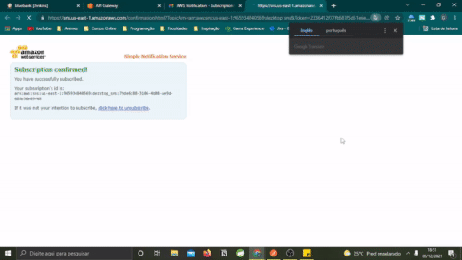</img><br>
	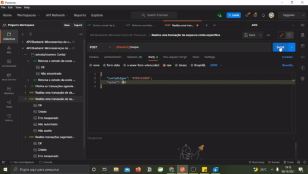</img>
</div>

<h1 align="center" id="requisitos">Requisitos e Funcionalidades</h1>
<h3 id="RQEntrega">Requisitos de Entrega</h3>

- [X] O código deve ser entregue em um repositório no Github.
- [X] A API deve ser disponibilizada em ambiente AWS com EC2 ou em Beanstalk.
- [X] A aplicação deve ter um pipeline em Jenkins ou no Aws Build.
- [X] A aplicação precisa ser configurada no API Gateway da AWS. <a href="Arquivos/API-Gateway">[Link]</a>
- [X] A aplicação precisa ter no mínimo um endpoint de SNS para cadastro de emails e verificação automática. <a href="Arquivos/SNS">[Link]</a>
- [X] A aplicação precisa ter no mínimo um Lambda. <a href="Arquivos/Lambda">[Link]</a>
- [X] O Banco deve ser entregue em script SQL junto ao repositório. <a href="Arquivos/Script-SQL">[Link]</a>
- [X] Liste os endpoints no README.md

<h3 id="RQFuncionais">Requisitos Funcionais</h3>
Os requisitos funcionais desta API giram em torno de um CRUD entre clientes e suas respectivas contas bancárias, logo, este sistema possibilita:

- O cadastro de clientes - Incluindo dados pessoais e informações para contato.
- A listagem de clientes - Você pode optar por listar todos os clientes existentes na base de dados ou buscar um em específico.
- A atualização de dados dos clientes.
- A exclusão de um cliente, e consequentemente de sua conta bancária.
- O histórico de transações entre contas.
- Efetuação de saques e depósitos.
- Efetuação de transações externas ou internas -TED, PIX, DOC, pagamentos ou transferências- agendadas ou não. 

<h3 id="endpoints">Endpoints</h3>
Os <b>endpoints</b> são literalmente pontas de um canal de comunicação. Neste caso em específico, o endpoint é uma das pontas da nossa API Bluebank, e por sua vez, essa API pode ser acessada/requisitada por uma URL que executa uma certa função quando chamada. Sendo assim, cada endpoint listado abaixo, executa um determinado trecho de código.

<hr>
<h4 align="center">Microsserviço de Clientes e Contas</h4>

> Porta: 8101 <br>
> Atributos entre chaves, indicam o parâmetro que você deve informar. <br>
> Exemplo: /pesquisa/{cpf} -> ***/pesquisa/46033184050*** <br>
> Nos endpoints de requisição do tipo ***POST*** e ***PUT*** você precisa informar os dados requeridos no corpo JSON. <br>

<h4 align="center">Endpoints relacionados ao Cliente</h4>

***[GET]*** Lista todos os clientes cadastrados:
```
/clientes
```
***[GET]*** Pesquisa um cliente pelo CPF:
```
/cliente/{cpf}
```
***[GET]*** Inscreve o email no tópico de notificações. É chamado no momento de criação do cliente:
```
/inscrever/{email}
```
***[GET]*** Envia o email de boas vindas para o tópico de notificações:
```
/notificar
```
***[POST]*** Cadastra um novo cliente:
```
/cliente
```
***[PUT]*** Atualiza os dados pessoais de um cliente:
```
/cliente/{cpf}
```
***[DELETE]*** Deleta um cliente da base de dados:
```
/cliente/{cpf}
```

<h4 align="center">Endpoints relacionados a Conta Bancária</h4>

***[GET]*** Retorna uma conta ao buscar por CPF:
```
/conta/cpf/{cpf}
```
***[GET]*** Retorna uma conta ao buscar por Número da conta:
```
/conta/numero/{numero}
```
> :warning: Os próximos dois endpoints só devem ser chamados pelo serviço de transações e não devem ser requisitados diretamente. :warning:	

***[PUT]*** Adiciona valor na conta especificada:
```
/conta/{numero}/credita/{valor}
```
***[PUT]*** Diminui valor na conta especificada. 
```
/conta/{numero}/debita/{valor}
```
<hr>
<h4 align="center">Microsserviço de Transações</h4>

> Porta: 8102

<h4 align="center">Endpoint relacionado ao  Agendamento</h4>

***[GET]*** Efetiva as transações agendadas do dia:
```
/agendamento/efetivar
```

<h4 align="center">Endpoints relacionados as Transações</h4>

***[GET]*** Retorna o extrato da conta especificada no mês corrente:
```
/extrato/{numeroConta}
```
***[GET]*** Retorna o extrato da conta especificada durante o mês informado:
```
/extrato/{numeroConta}/{mes}/{ano}
```
***[POST]*** Realiza uma transação de depósito na conta especificada:
```
/deposito
```
***[POST]*** Realiza uma transação de saque na conta especificada:
```
/saque
```
***[POST]*** Realiza transações (agendadas ou não) para contas internas e externas incluindo pagamentos:
```
/transacao
```
<h3 id="swagger">Swagger</h3>
O <a href="https://swagger.io/">Swagger(OpenAPI)</a> é uma especificação aberta para definição/descrição de APIs REST. Você pode achar mais informações sobre o Swagger <a href="https://www.ibm.com/docs/pt-br/integration-bus/10.0?topic=ssmkhh-10-0-0-com-ibm-etools-mft-doc-bi12018--htm">aqui</a> e pode testar uma demonstração ao vivo do Swagger aqui: <a href="https://petstore.swagger.io/">Swagger Petstore</a>.<br>
Utilizamos o <a href="https://github.com/swagger-api/swagger-ui">Swagger UI</a> para documentar, visualizar e requisitar/acessar a nossa API em um navegador Web. <br>
Para acessar localmente, utilize a URL:

`http://localhost:8101/swagger-ui.html` 	 e 		`http://localhost:8102/swagger-ui.html`

<h4 align="center">Microsserviços de clientes e contas</h4>
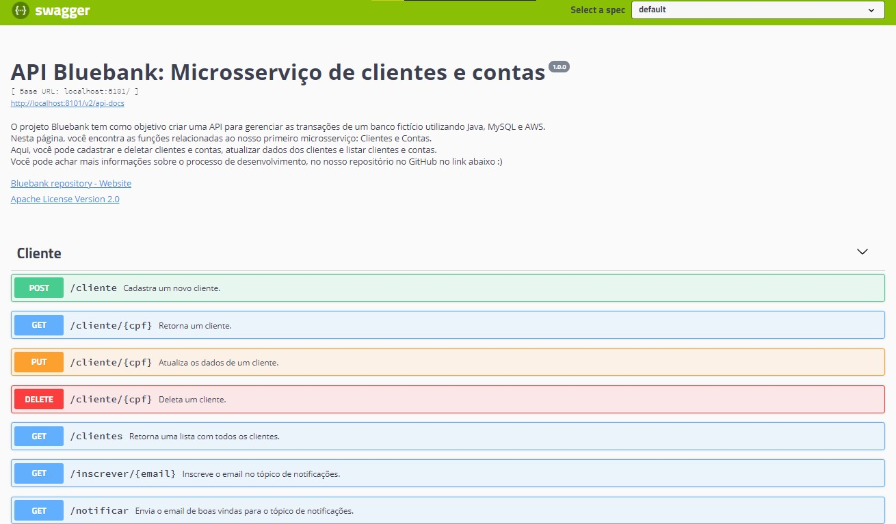</img>
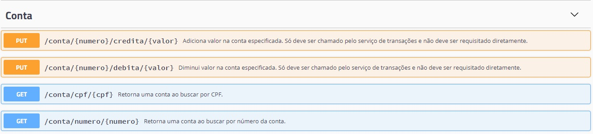</img>
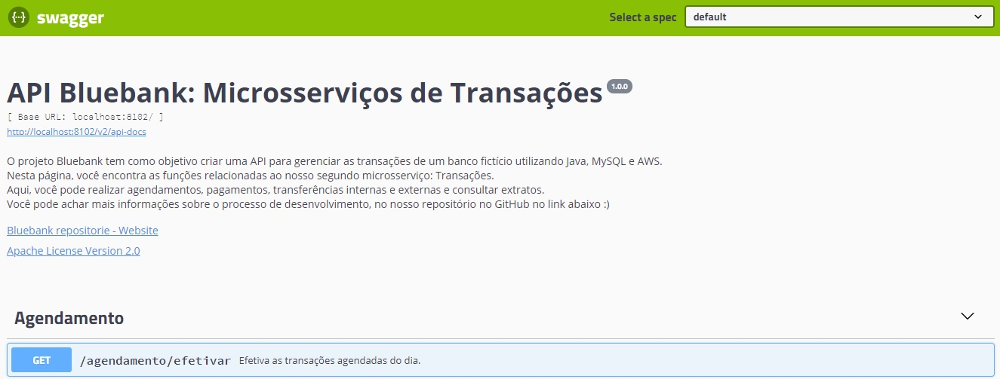</img>
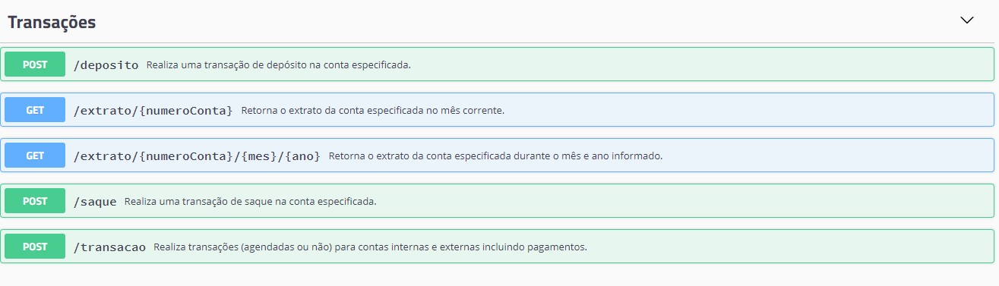</img>

Note que há alguns links além das descrições gerais do projeto e das descrições de cada endpoint.
- O primeiro link refere-se a visualização de um documento JSON com todos os endpoints da nossa API. Posteriormente, iremos importar esses arquivos no Postman, clique <a href="Arquivos/json">aqui</a> para acessá-los ou salve diretamente do seu navegador clicando em: botão direito-> Salvar como...
- O segundo link lhe direciona para este repositório :smile:
- O terceiro link, refere-se a licença Apache.

Para interagir com a API através do Swagger UI, clique em um dos endpoints e clique em "Try it Out" (alguns endpoints possuem descrições mais assertivas).
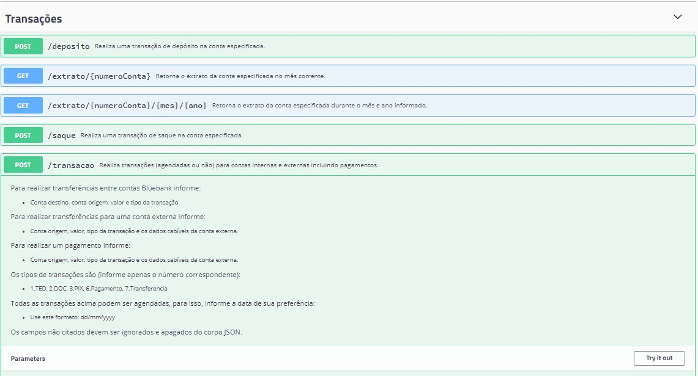</img>

Adicione as informações necessárias e clique em "Execute".
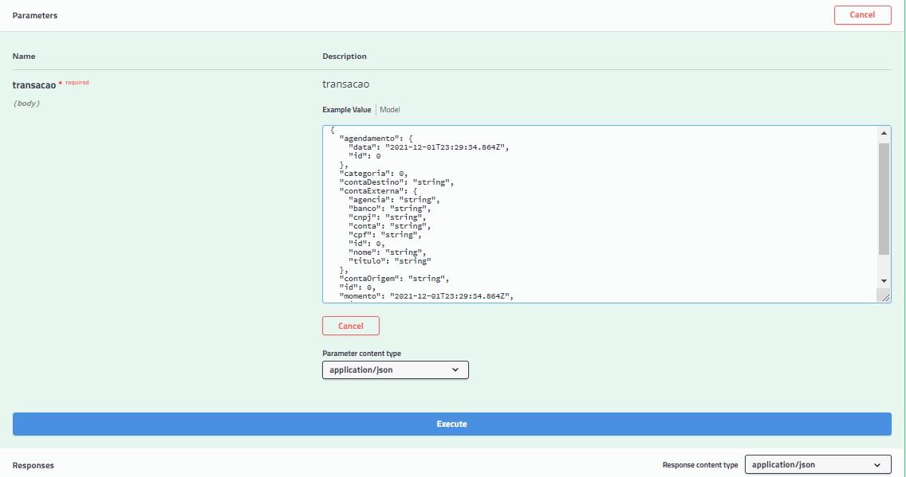</img>

Prontinho !! Você interagiu com a nossa API. :smile: :partying_face:	

Cada endpoint possui um conjunto de códigos do status de retorno.
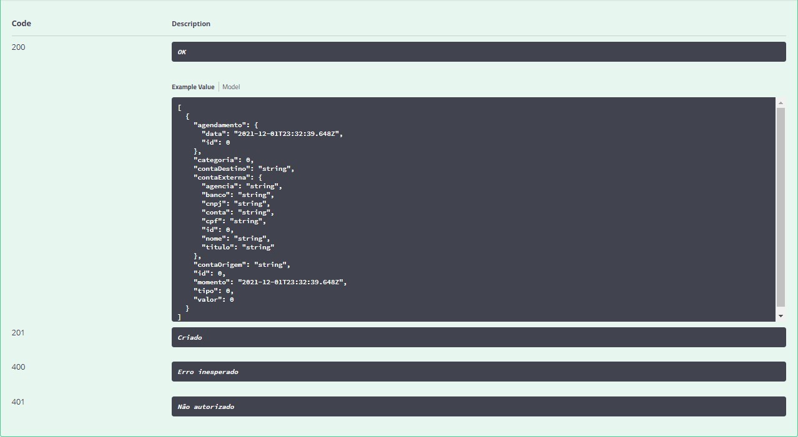</img>

Caso não tenha ficado claro, você pode acessar esses links para sanar suas dúvidas:
- <a href="https://developer.mozilla.org/pt-BR/docs/Web/HTTP/Status">Códigos de status de respostas HTTP</a>
- <a href="https://medium.com/@thiagogrespi/testes-de-api-parte-1-entendendo-e-botando-a-m%C3%A3o-na-massa-com-postman-b365923b83e1">Testes de API</a>

<h3 id="postman">Postman</h3>
O Postman é uma ferramenta utilizada para análisar,testar e desenvolver APIs REST por meio do envio de requisições HTTP, você pode consumir serviços de APIs locais ou da internet. Para mais informações sobre a ferramenta veja: <a href="https://enotas.com.br/blog/postman/">O que é o Postman?</a> e <a href="https://www.devmedia.com.br/testando-apis-web-com-o-postman/37264">Testando APIs Web com o Postman</a>.

Em seguida, iremos mostrar como fazer requisições na nossa API utilizando o Postman. 
- Primeiro, importe os <a href="Arquivos/json">arquivos</a> gerados pelo <a href="#swagger">Swagger</a>.
	- Abra o Postman, clique em `File` -> `Import` -> `File` -> `Upload files`. 
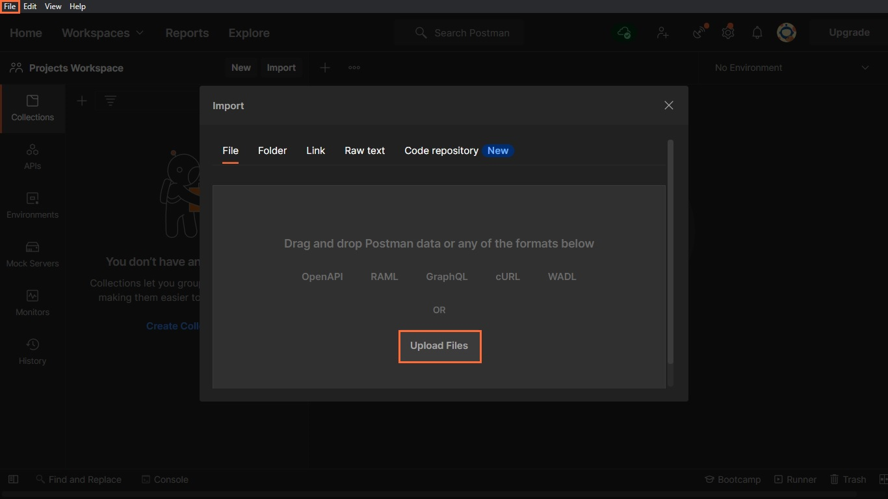</img>

	- Informe os arquivos que serão importados e depois clique em `Import`.
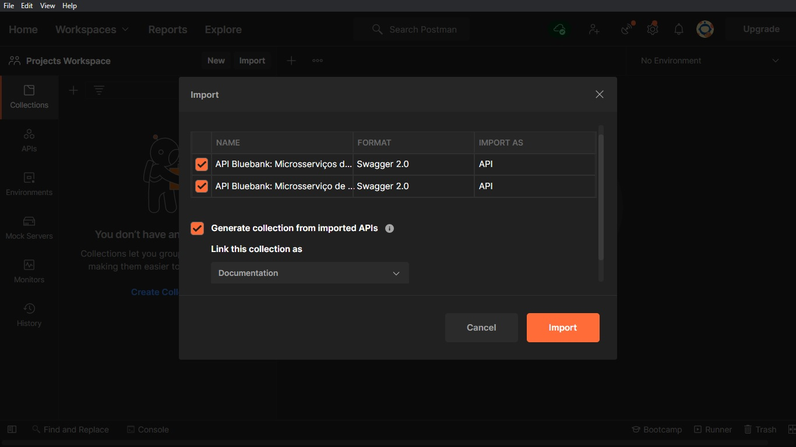</img>

	- Depois de importar o arquivo, clique em `Colections`.
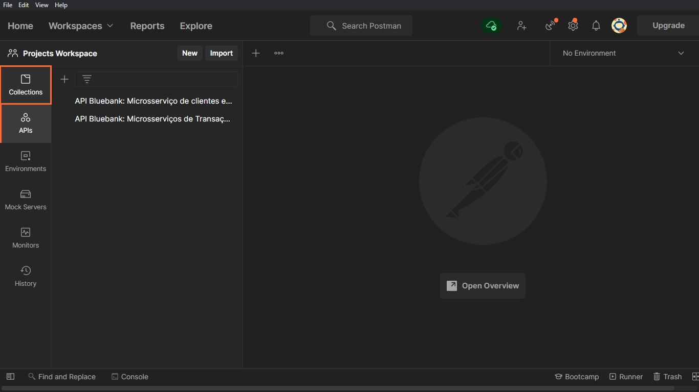</img>

	- Agora precisamos modificar nossa váriavel de ambiente. Selecione a collection destacada em laranja -> Clique em "Variables" -> Mude o valor de "Current Value" para `localhost:8101`.<br>Para salvar clique nos 3 pontinhos destacados acima de "Variables" e depois clique em "Save". Repita o processo para a segunda collection, mudando o valor para `localhost:8102`.
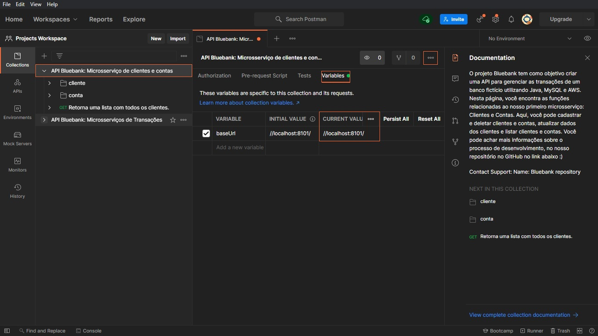</img>

	- Prontinho !! A partir daqui você consegue testar a nossa API ! Para isso, escolha uma das requisições e clique em `Send` :smile:.
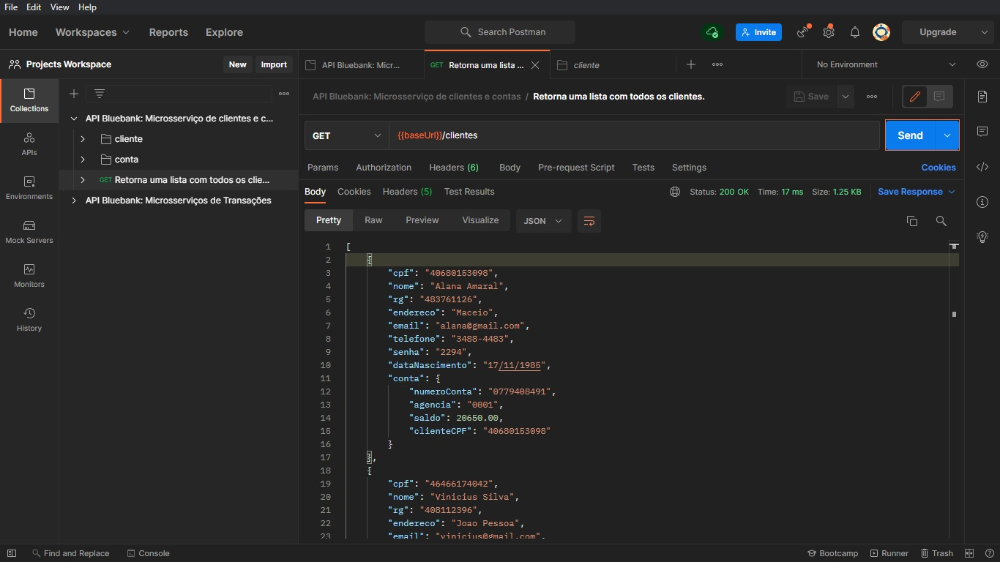</img>

	- Algumas requisições do tipo "GET" e `PUT`exigem que você informe algum parâmetro na URL.<br>Substitua os parâmetros indicados por `:` pelos valores reais.<bR>Nesse caso o parâmetro era `:numeroConta`.
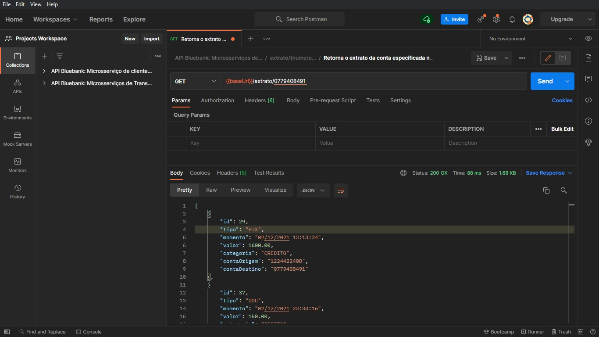</img>

	- Lembre-se que em requisições do tipo `POST` e `PUT` os valores são inseridos no corpo JSON.<br>Para isso, clique em `Body` -> `Raw` -> `JSON`.<br>Agora é só substituir os valores !
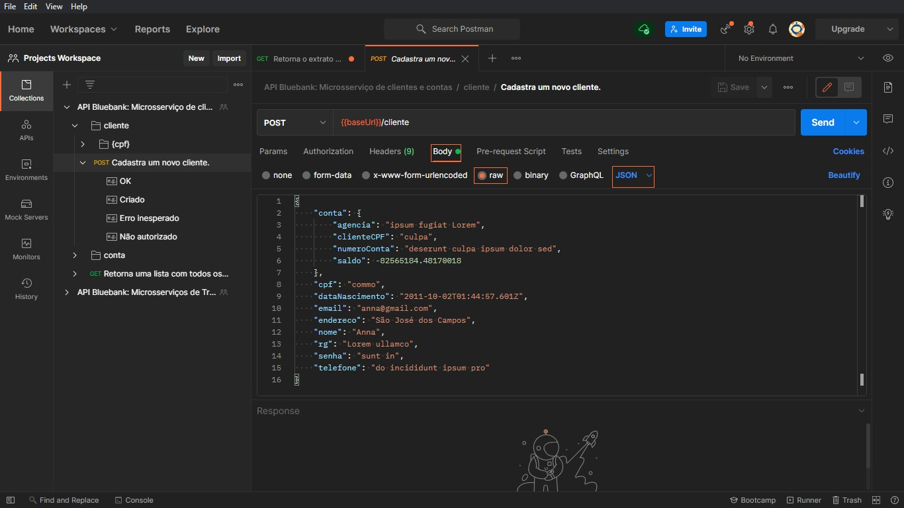</img>

A seção de <a href="#endpoints">Endpoints</a> e a documentação do <a href="#swagger">Swagger</a> podem ser suas aliadas aqui :grin:.
Você também acessar a documentação do Postman <a href="https://learning.postman.com/docs/getting-started/introduction/">aqui</a>.

<p align="right"><a href="#topo">Você pode voltar ao topo clicando aqui ↑</a></p>
<h1 id="desenvolvimento" align="center">Desenvolvimento</h1>
<h3 id="jira">Quadro Kanban</h3>
Para a organização do projeto, utilizamos o <a href="https://www.atlassian.com/br/software/jira">Jira</a> e criamos um quadro <a href="https://www.atlassian.com/agile/kanban">Kanban</a>. A formatação do quadro utilizada pelo grupo foi de "To Do, Doing, Testing, Done":
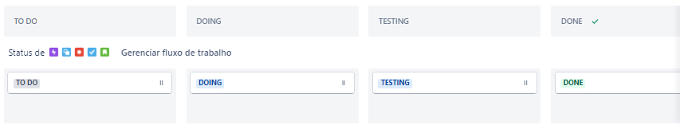</img><br>

Já no jira, nas configurações do projeto, ativamos o recurso de <a href="https://support.atlassian.com/jira-software-cloud/docs/enable-the-backlog/">"Lista de Pendências / Priorização"</a>, que fornece um espaço exclusivo para planejar e priorizar o trabalho, e o recurso de <a href="https://www.atlassian.com/agile/scrum/sprints">"Sprints"</a> que permite o planejamento e conclusão do trabalho em unidades de tempo fixas. Assim, nos restava apenas planejar a sprint já que todas as histórias e tarefas criadas iam diretamente para o backlog do projeto.
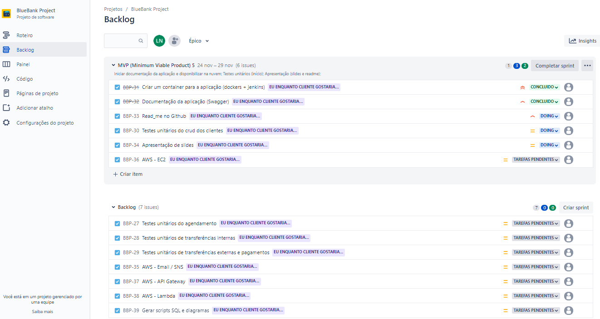</img><br>

Note que:
- O painel <b>MVP (Minimum Viable Product) 5</b> indica a sprint que está sendo executada no momento. Seu período de duração foi do dia 24 ao dia 29 de novembro.
- O painel do <b>Backlog</b>, indica as tarefas que ainda serão realizadas em uma Sprint futura.
- Há um indicador de priorização em cada card. Os status de priorização são definidos por: :arrow_double_up: Highest, :arrow_up_small: High, <a href="https://www.flaticon.com/br/autores/freepik" title="Freepik"></img></a> Medium, :arrow_down_small: Low, :arrow_double_down: Lowest

Procuramos criar as tarefas e histórias o mais completas possíveis, e quando necessário, adicionavamos os detalhes da na descrição do card.
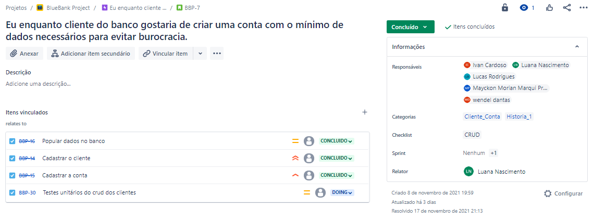</img>
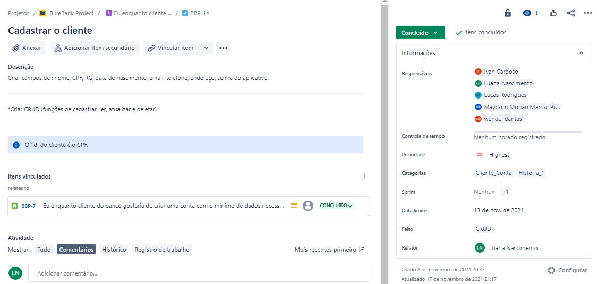</img>
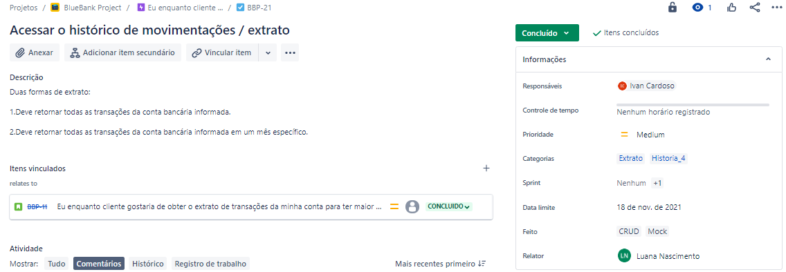</img>

Note que:
- Há relações entre histórias e tarefas. Nos cards de história, as tarefas "filhas" dessa história estão vinculadas, e portanto são mostradas na descição da mesma.
- Há descrições extras em alguns cards.
- Os responsáveis pela tarefa são indicados nos cards na categoria "Responsáveis".

E por último, todas as tarefas e histórias estão vinculadas ao épico **_"Eu enquanto cliente gostaria de abrir uma conta no banco para que eu possa efetuar transações financeiras"_**
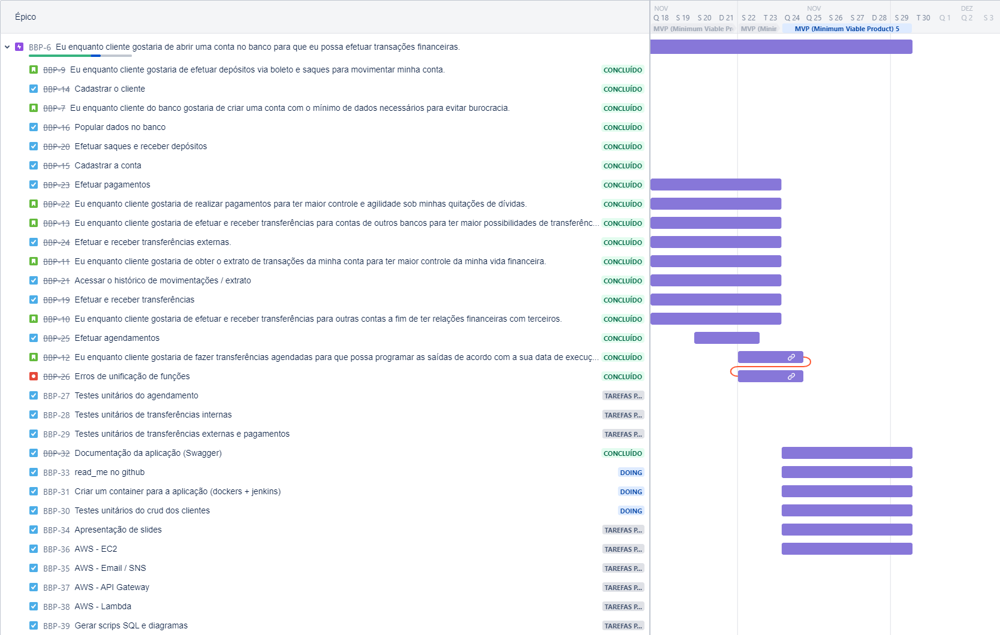</img>

<h3 id="testes">Execução dos Testes</h3>
Fizemos alguns testes unitários relacionados ao CRUD de clientes e ao processo de creditar e debitar saldo de contas, contido no primeiro microsserviço. Você pode ver o código dos testes, clicando <a href="bluebank/BlueBank/src/test/java/com/squad/dezktop/service/">aqui</a>.

<h2 id="aws">AWS</h2>
<h3 id="servicos">Serviços Utilizados</h3>
O Jenkins foi instalado numa <a href="https://aws.amazon.com/pt/ec2/">instância EC2</a> e cria toda a aplicação através do arquivo <a href="Jenkinsfile">Jenksfile</a> existente no diretório raiz do projeto no github.
Configuramos todos os endpoints no <a href="https://aws.amazon.com/pt/api-gateway/">API Gateway</a>, importando as documentações das APIs do Swagger e mapeando os endpoints de cada microsserviço.
Criamos uma função <a href="https://aws.amazon.com/pt/lambda/">Lambda</a> em NodeJs para fazer um request no endpoint /agendamento/efetivar que é acionada por um gatilho no <a href="https://aws.amazon.com/pt/eventbridge/">Event Bridge</a> definido para executar de segunda à sexta às 8 horas da manhã.
Ao executar a função Lambda todas as transações agendadas na aplicação são efetivadas e podemos ver o resultado através do log do <a href="https://aws.amazon.com/pt/cloudwatch/">Cloud Watch</a>.
Como requisito do projeto, também implementamos dois endpoints para se comunicarem com o serviço  <a href="https://aws.amazon.com/pt/sns/">SNS da AWS</a>.
O endpoint /inscrever/{email} faz a inscrição do email passado como parâmetro no tópico de notificações.
O endpoint /notificar envia um email de boas-vindas para todos os emails inscritos no tópico de notificações.


<h3 id="deploy">Estratégia de Deploy</h3>
Criamos uma pipeline no <a href="https://www.jenkins.io/download/">Jenkins</a> que é acionada a partir de qualquer commit na branch main do repositório do projeto no github.
A pipeline faz o checkout do projeto através do git, faz o build das aplicações java (eureka-server, cliente-conta e transacoes) e executa o docker-compose, lendo o arquivo <a href="docker-compose.yml">docker-compose.yml</a>, para fazer o build e executar um container para cada aplicação java (através de seus respectivos Dockerfile), além de criar um container de banco de dados em <a href="https://www.mysql.com/">MySQL</a> que será utilizado pela aplicação.

<p align="right"><a href="#topo">Você pode voltar ao topo clicando aqui ↑</a></p>
<h3 id="tecnologias">Ferramentas e tecnologias utilizadas</h3>
<div id="tecnologias" style="display: inline_block" align="center"><br>
    <a href="https://www.oracle.com/br/java/technologies/javase/jdk11-archive-downloads.html">
        
    </a>
    <a href="https://spring.io/tools#suite-three">
        
    </a>
    <a href="https://www.mysql.com/">
        
    </a>
    <a href="https://aws.amazon.com/pt/sns/">
        
    </a>
   <a href="https://aws.amazon.com/pt/lambda/">
        
    </a>
    <a href="https://aws.amazon.com/pt/api-gateway/">
        
    </a>
   <a href="https://aws.amazon.com/pt/ec2/">
        
    </a>
	<a href="https://aws.amazon.com/pt/eventbridge/">
        
    </a>
    </a>
	<a href="https://aws.amazon.com/pt/eventbridge/">
        
    </a>
    <a href="https://www.docker.com/get-started">
     
    </a>
    <a href="https://www.jenkins.io/download/">
        
    </a>
        <a href="https://www.atlassian.com/br/software/jira">
        
    </a>
    <a href="https://www.postman.com/downloads/">
        
    <a href="https://git-scm.com/">
        
    </a>
    <a href="https://www.phpmyadmin.net/downloads/">
        
    </a>
    <a href="https://www.apachefriends.org/pt_br/index.html">
        
    </a>
</div>
